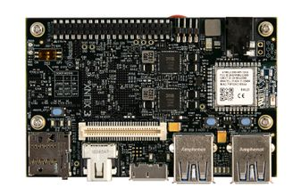

\



## Grab the pre-built SD images!
Click the releases tab above or [here](https://github.com/Avnet/Ultra96-PYNQ/releases) for instructions and the images for Ultra96 v1 or v2

## Build PYNQ SD Image for Ultra96 V1/V2 (optional for advanced users)

This repository contains source files and instructions for building PYNQ to run on the 
[Ultra96 board](http://zedboard.org/product/ultra96). Users can leverage the included
Petalinux BSPs to build the images on their own.

## Quick Start

Building PYNQ for Ultra96 can take many hours to complete.  Plan accordingly!

**Required tools:**
* Ubuntu 16.04 LTS 64-bit host PC
* Passwordless SUDO privilege for the building user
* At least 160GB of free hard disk space if you do not have the Xilinx tools installed yet
* Roughly 80GB of free hard drive space if you have the Xilinx tools installed
* You may be able to get away with less free hard drive space, YMMV
* At least 8GB of RAM (more is better)
* Xilinx PetaLinux and Vivado or SDx (find the version compatible to a specific PYNQ release at
[Xilinx Tool Version](https://pynq.readthedocs.io/en/latest/pynq_sd_card.html));
read Xilinx UG1144 for PetaLinux setup requirements
* [Create a Xilinx account](https://www.xilinx.com/registration/create-account.html) to obtain and license the tools.

Retrieve the Ultra96 PYNQ board git into a NEW directory somewhere outside the PYNQ git directory.

```shell
git clone https://github.com/Avnet/Ultra96-PYNQ.git <LOCAL ULTRA96>
```

Setup Ultra96-PYNQ git to work on a branch (for example,`image_v2.5`).

```shell
cd <LOCAL ULTRA96>
git checkout origin/image_v2.5
```

## Using Included BSPs

A BSP for building PYNQ for Ultra96 V1 and V2 are already included in this repo.
Users can use these BSPs to build PYNQ images by themselves.
If you would like to build your own BSPs, [see notes at bottom](#building-pynq-compatible-bsps-from-scratch).

You must now choose Ultra96 board V1 or V2.  Change the softlink to point to the desired board version spec file by replacing 'X' with '1' or '2'.

```shell
cd <LOCAL ULTRA96>/Ultra96
ln -s specs/Ultra96_vX.spec Ultra96.spec
ln -s petalinux_bsp_vX petalinux_bsp
cp -f sensors96b/sensors96b.bit.vX sensors96b/sensors96b.bit
cp -f sensors96b/sensors96b.tcl.vX sensors96b/sensors96b.tcl
cp -f sensors96b/sensors96b.hwh.vX sensors96b/sensors96b.hwh
```

Retrieve the main PYNQ repo into a NEW directory somewhere outside the Ultra96-PYNQ directory.

```shell
git clone https://github.com/Xilinx/PYNQ.git <LOCAL PYNQ>
```

Setup PYNQ git to work on a branch (for example, `image_v2.5`).

```shell
cd <LOCAL PYNQ>
git checkout origin/image_v2.5
```

Configure and install build tools, this will take some effort and will be an iterative process. Run `setup_host.sh` to install missing tools, `make checkenv` to check if all tools are installed.

```shell
cd sdbuild
./scripts/setup_host.sh
make checkenv
```

In your PYNQ repository go to the directory `sdbuild` and run make.

**IMPORTANT: For the BOARDDIR path setting it should be absolute not relative, you have been warned!**

```shell
make clean
make BOARDDIR=<LOCAL ULTRA96>
```

Once the build has completed (it will take a long long time), if successful an SD card image will be available under the PYNQ git directory `sdbuild/output`.
Depending on the PYNQ release, the image may have different names; 
as an example, for PYNQ v2.5, the image is `Ultra96-2.5.img`.

Use Etcher or Win32DiskImager to write this image to an SD card. 
Insert card, PYNQ should boot up on the Ultra96!

For more information about how to setup and use PYNQ for Ultra96, please refer
to the [online documentation](https://ultra96-pynq.readthedocs.io/en/latest/).

## Building PYNQ-compatible BSPs from scratch

**IMPORTANT: 2019.1 u-boot source for Ultra96 v1 and v2 will break any PetaLinux compile.  If making your own bsp you must include the patch, bsp.cfg and recipe found here: https://github.com/Avnet/Ultra96-PYNQ/tree/master/Ultra96/petalinux_bsp_v1/meta-user/recipes-bsp/u-boot**

**Also, for Ultra96 v2 the u-boot fix is only in the bsp itself not in the petalinux_bsp_v2/meta-user/recipes-bsp/u-boot folder.  The Ultra96 v2 bsp also does not include the extra bsp.cfg, this should not matter to most users.**

Note building your own bsp is optional; it is needed only if you have good reason not to use the included BSP.

Obtain and install Xilinx Vivado or SDx and PetaLinux on Ubuntu 16.04 
LTS. For Xilinx tools, you will need a version compatible to the PYNQ release
(for Xilinx tool compatibility, please find information at 
[Xilinx Tool Version](https://pynq.readthedocs.io/en/latest/pynq_sd_card.html).
If you are installing the Xilinx tools for the first time on your 
existing setup you must read Xilinx UG1144 for PetaLinux setup requirements.

If you prefer, you can also setup all the tools on a VirtualBox VM 
(e.g. using [Vagrant software](https://pynq.readthedocs.io/en/latest/pynq_sd_card.html#prepare-the-building-environment)).
If you purchase an Ultra96 board, a free voucher for the full-version Xilinx 
SDX tool suite and PetaLinux is included.

Use the Xilinx SDx or Vivado tools to generate the hardware design.
The hardware design source files contain a PL (Xilinx Programmable Logic) 
design that will enable PYNQ to interact with a Grove mezzanine board.
The hardware design also contains Ultra96 board specific settings.
After building the hardware design, it will be manually imported into the 
PetaLinux BSP to be used for PYNQ. To build the hardware design that 
PetaLinux will boot up with:

```shell
cd <LOCAL ULTRA96>/Ultra96/sensors96b
cp -f sensors96b.tcl.vX sensors96b.tcl
make
```

After the hardware design has finished building and you have installed 
PetaLinux then create the Ultra96 BSP by executing PetaLinux commands from the 
ROOT DIRECTORY of the Ultra96 PYNQ board git. You may see a couple warnings 
after the -config, those are normal:

```shell
cd <LOCAL ULTRA96>
mkdir bsp
cd bsp
petalinux-create -t project -n sensors96b --template zynqMP
cd sensors96b
petalinux-config --get-hw-description=../../Ultra96/sensors96b
```

After the system config menus appear you need to set the following case-sensitive values, after completion exit and save:
* Subsystem AUTO Hardware Settings → Serial Settings → Primary stdin/stdout → (psu_uart_1)
* DTG Settings → MACHINE_NAME → (avnet-ultra96-rev1)
* u-boot Configuration → u-boot config target → (avnet_ultra96_rev1_defconfig)
* Image Packaging Configuration → Root filesystem type → (SD card)
* Yocto Settings → YOCTO_MACHINE_NAME → (ultra96-zynqmp)

To work around a bug for Ultra96 that prevents including your own hardware 
design you must edit `<LOCAL ULTRA96>/bsp/sensors96b/project-spec/meta-user/conf/petalinuxbsp.conf`.
Add the following line at the bottom of the file: 
```
MACHINE_FEATURES_remove_ultra96-zynqmp = "mipi"
```

For V2 you may want to remove the TI WiFi driver module. Search through 
device drivers, networking, wireless and deselect the Texas Instrument drivers:
```shell
petalinux-config -c kernel
```

Finish creating the BSP by packaging it up into a single BSP file and placing 
it for PYNQ to find. 'X' should be set to '1' or '2' for U96 v1 or v2:

```shell
cd <LOCAL ULTRA96>/bsp
rm ../Ultra96/sensors96b_vX.bsp
petalinux-package --bsp -p sensors96b --hwsource ../Ultra96/sensors96b/sensors96b --output ../Ultra96/sensors96b_vX.bsp
```

Note: The PYNQ packages scripts and extra files will pull in v2 critical changes such as the wifi driver.
