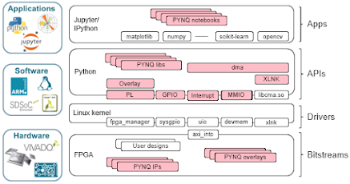

\

## Build PYNQ v2.4 for Ultra96 using included 2018.3 PetaLinux BSP:
This repository contains source files and instructions for building PYNQ to run on the 
[Ultra96 board](http://zedboard.org/product/ultra96).
## Quick Start
**Building PYNQ for Ultra96 can take many hours to complete.  Plan accordingly!**\
\
**IMPORTANT: Building PYNQ requires passwordless SUDO privilege for the building user!**\
\
**Required tools:**
* Ubuntu 16.04 LTS 64-bit host PC
* At least 130GB of free hard disk space if you do not have the Xilinx tools installed yet
* Roughly 60GB of free hard drive space if you have the Xilinx tools installed
* You may be able to get away with less free hard drive space, YMMV
* At least 8GB of RAM (more is better)
* Xilinx PetaLinux 2018.3, read Xilinx UG1144 for PetaLinux setup requirements
* A free Xilinx developer account to obtain and license the tools: https://www.xilinx.com/registration/create-account.html

**Retrieve the Ultra96 PYNQ board git into a NEW directory somewhere outside the PYNQ git directory:**
```shell
git clone https://github.com/Avnet/Ultra96-PYNQ.git [LOCAL ULTRA96]
```
**Setup Ultra96-PYNQ git to work on branch "image_v2.4_v2":**
```shell
cd <LOCAL ULTRA96>
git checkout origin/image_v2.4_v2
```
## Note: A BSP for building PYNQ for Ultra96 V1 and V2 are already included in this repo.  If you would like to build your own see note at bottom.

**You must now choose the bsp for Ultra96 board V1 or V2.  Change the softlink to point to the desired board version spec file by replacing 'X' with '1' or '2'**
```shell
cd <LOCAL ULTRA96>/Ultra96
ln -s ./spec/Ultra96_vX.spec ./Ultra96.spec
ln -s ./petalinux_bsp_vX ./petalinux_bsp
```
**Retrieve the main PYNQ repo into a NEW directory somewhere outside the Ultra96-PYNQ directory:**
```shell
git clone https://github.com/Xilinx/PYNQ.git [LOCAL PYNQ]
```
**Setup PYNQ git to work on branch "image_v2.4":**
```shell
cd <LOCAL PYNQ>
git checkout origin/image_v2.4
```
**Configure and install build tools, this will take some effort and will be an iterative proces. Install on your own any missing tools:**
```shell
cd sdbuild
make checkenv
```
**In your PYNQ repository go to the directory "sdbuild" and run make:**\
**IMPORTANT: For the BOARDDIR path setting it should be absolute not relative, you have been warned!**
```shell
make clean
make BOARDDIR=<LOCAL ULTRA96>
```
**Once the build has completed (it will take a long long time), if successful an SD card image will be available under the PYNQ git directory here: ./sdbuild/output/Ultra96_v2.4.img**
\
\
**Use Etcher or Win32DiskImager to write this image to an SD card.  Insert card, PYNQ should boot up on the Ultra96!**

**For more information about how to setup and use PYNQ for Ultra96:** https://ultra96-pynq.readthedocs.io/en/latest/

## Note: How to build a PYNQ compatible BSP from scratch for Ultra96 (Optional: only if you have good reason to not want to use the built-in bsp)

**Obtain and install Xilinx Vivado or SDx and PetaLinux v2018.3 on Ubuntu 16.04 LTS. If you are installing the Xilinx tools for the first time on your existing setup you must read Xilinx UG1144 for PetaLinux setup requirements.  If you prefer, you can also setup all the tools on a VirtualBox VM.  Follow Avnet's VM and Xilinx tools install instructions here: (http: TBD) If you purchase an Ultra96 board, a free voucher for the full-version Xilinx SDX tool suite and PetaLinux 2018.3 is included**

**Use the Xilinx SDx or Vivado tools to generate the hardware design.  The hardware design source files contain a PL (Xilinx Programmable Logic) design that will enable PYNQ to interact with a Grove mezzanine board.  The hardware design also contains Ultra96 board specific settings.  After building the hardware design, it will be manually imported into the PetaLinux BSP to be used for PYNQ.  To build the hardware design that PetaLinux will boot up with:**
```shell
cd <LOCAL ULTRA96>/Ultra96/sensors96b
make clean
make
```
### Note: the above will build a hardware design for Ultra96 V1 if you are using V2 use "make u96v2".

### TBD: This is only for v1, need to add instructions for v2
**After the hardware design has completed building and you have installed PetaLinux 2018.3 then create the Ultra96 BSP by executing PetaLinux cmds FROM the TOP DIRECTORY of the Ultra96 PYNQ board git. You may see a couple warnings after the -config, those are normal:**
```shell
cd <LOCAL ULTRA96>
mkdir bsp
cd bsp
petalinux-create -t project -n sensors96b --template zynqMP
cd sensors96b
petalinux-config --get-hw-description=../../Ultra96/sensors96b/sensors96b/sensors96b.sdk
```
**After the system config menus appear you need to set the following case-sensitive values, after completion exit and save:**
* Subsystem AUTO Hardware Settings → Serial Settings → Primary stdin/stdout → (psu_uart_1)
* DTG Settings → MACHINE_NAME → (avnet-ultra96-rev1)
* u-boot Configuration → u-boot config target → (avnet_ultra96_rev1_defconfig)
* Image Packaging Configuration → Root filesystem type → (SD card)
* Yocto Settings → YOCTO_MACHINE_NAME → (ultra96-zynqmp)

**To work around a bug for Ultra96 that prevents including your own hardware design you must edit <LOCAL ULTRA96>/bsp/sensors96b/project-spec/meta-user/conf/petalinuxbsp.conf**\
Add the following line at the bottom of the file:  MACHINE_FEATURES_remove_ultra96-zynqmp = "mipi"\
\
**OPTIONAL: configure u-boot to decrease the boot delay:**
```shell
petalinux-config -c u-boot
```
*Optionally change "delay in seconds before automatically booting", default is 4 seconds then exit and save*\
\
**OPTIONAL: For V2 you may want to remove the TI WiFi driver. Search through device drivers, networking, wireless and deselect the Texas Insrument drivers:**
```shell
petalinux-config -c kernel
```
**Finish creating the BSP by packaging it up into a single BSP file and placing it for PYNQ to find:**
```shell
cd <LOCAL ULTRA96>/bsp
rm ../Ultra96/sensors96b.bsp
petalinux-package --bsp -p sensors96b --hwsource ../Ultra96/sensors96b/sensors96b --output ../Ultra96/sensors96b.bsp
```
