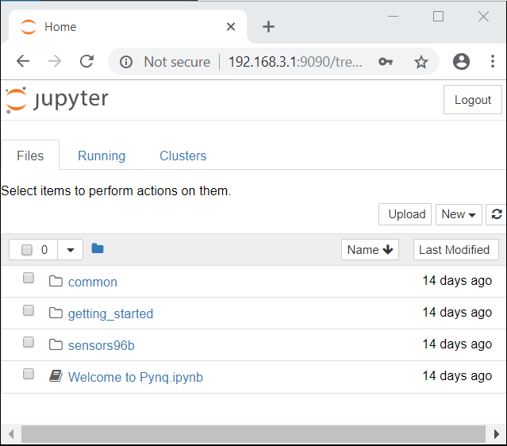
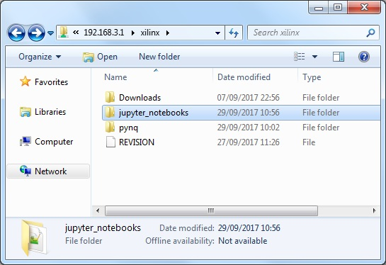

***************
Getting Started
***************

This guide will show you how to setup your computer and Ultra96 board to get
started using PYNQ. 

For information on the Ultra96 board, see the Avnet page: http://zedboard.org/product/ultra96

Getting Started Video
=====================

You can watch the getting started video guide, or follow the instructions below.

.. raw:: html

    <embed>
         <iframe width="560" height="315" src="https://www.youtube.com/embed/is34FBOlDJE" frameborder="0" allowfullscreen></iframe>
          
          
    </embed>

Ultra96 Setup Guide
===================

The PYNQ environment can be accessed using a web browser over a network connection. You can connect to the board in three main ways:

* USB cable (preferred)
* Use the board's WiFi access point
* Connect a monitor, keyboard and mouse directly to the board. 

All three connection methods will be covered below. USB cable is the recommended way to start using PYNQ on the Ultra96. 

USB cable board setup
---------------------

   .. image:: images/ultra96_setup.png
      :height: 600px
      :scale: 75%
      :align: center

  1. Insert the Micro-SD card
   
  2. Connect the Mirco USB cable from your PC to the board 

  3. Connect the power supply to the board

  4. Press the SW3 power button to power on the board

.. warning : Always unplug the power cable before installing or removing mezzanine cards and peripherals. Do not remove the power cable or unplug the power supply while the board is running. Failure to do so can cause damage to the board. TO shutdown the board, run (sudo) shutdown now, wait for the OS to shutdown, and then press the power button to turn off

.. _turning-on-the-Ultra96:
	
Turning on the Ultra96
----------------------

The green power LED (beside the power switch), and the red Init LED (near the SD Card socket) will turn on when the power button is pressed. After a few seconds, the red LED will switch off, and the green Done LED will switch on. The board will be ready after the blue and orange LEDs switch on.  

.. _connecting-to-the-Ultra96:

Connecting to the Ultra96
-------------------------

USB cable
^^^^^^^^^

When connected to a computer using the USB cable, the board can act as an Ethernet device ("Ethernet Gadget"). This is the recommended way to connect to the board from your computer, and allows you use a browser on your host computer. 

When the USB cable is connected, an Ethernet device should be detected automatically on the host computer (Windows/Linux). A driver should already be available in Windows 10 and Linux. In Windows 7 a driver should start to install automatically when the board is connected. 

Skip to :ref:`connecting-to-jupyter-notebooks` or keep reading for other connection options.

WiFi
^^^^

The Ultra96 includes a WiFi chip that can be used to connect to other WiFi networks as a client. 

Other WiFi networks
^^^^^^^^^^^^^^^^^^^

You can connect the Ultra96 to other WiFi networks (E.g. your home WiFi network). If you can connect to the board using the USB cable, then you can use the WiFi notebook in the Jupyter home area to configure the board to connect to a WiFi network: 

.. code-block:: console

    <Jupyter Home>/common/wifi.ipynb 

If you are familiar with configuring network connections in Linux, you can also configure your connection using a terminal. 

Skip to :ref:`connecting-to-jupyter-notebooks` or keep reading for other connection options.

DisplayPort monitor
^^^^^^^^^^^^^^^^^^^

You can also use the board like a mini-PC by connecting a keyboard and mouse, and a HDMI or DisplayPort monitor to the mini DisplayPort on the board. The Chromium browser is installed on the board and can be used with PYNQ.

Note that you can try PYNQ examples in this mode, but for optimal performance it is recommended to use a browser from a computer connected to the board.

.. _connecting-to-jupyter-notebooks:

Connecting to Jupyter Notebooks
===============================

To connect to Jupyter Notebook, on the host computer, open a web browser (Chrome is preferred) and browse to one of the following addresses depending on how you setup your connection to the board in the instructions above:

* USB: http://192.168.3.1 
* Other WiFi: Browse to the IP address of the board http://<IP address of board> You can find the IP from a terminal, from your router, or from a network scanning app. 
* DisplayPort monitor: from the Chromium browser, browse to http://192.168.3.1

It may take a few seconds for your computer to resolve the IP address and connect to the board the first time it is powered on. 

Note that the board can have multiple connections to different networks at the same time. E.g. USB and *securbrd* WiFi. The board will have a different IP for each connection, and you can choose to use any of the available connections.  

If your board is configured correctly you will be presented with a login
screen. Enter the password as **xilinx**

After logging in, you should see the following screen:

Example Notebooks
-----------------

PYNQ uses the Jupyter Notebook environment to provide examples and documentation.
Using your browser you can view and run the notebook documentation interactively.

To get started using PYNQ, try running the provided example notebooks:

* **getting_started**: includes an introduction to using Jupyter notebook with PYNQ, the Python environment, and how to use some basic features of the current platform.
* **common**: contains example notebooks on how to download an overlay, how to set the Zynq clocks, how to execute Linux shell commands, and how to use USB devices.
* **sensors96b**: includes example notebooks to use peripherals with the mezzanine board.

When you open a notebook and make any changes, or execute cells, the notebook
document will be modified. It is recommended that you "Save a copy" when you
open a new notebook. If you want to restore the original versions, you can
download all the example notebooks from `Avnet's Ultra96 Github Repository
<https://github.com/Avnet/Ultra96-PYNQ>`_.

Serial connection
^^^^^^^^^^^^^^^^^

The board can act as a USB-Ethernet device, a serial port, and a USB mass storage device at the same time over the micro USB cable.

When a USB cable is connected to your computer, the board should be detected as a serial device automatically . Windows 10 and Linux include a serial driver by default. On Windows 7, the device should be detected, but the driver needs to be installed manually. The driver is included on the mass storage device that also appears when the cable is connected. You can install the driver in the *serial_driver* folder. 

Note that the USB terminal can be useful for debug, but is not intended to be used to access PYNQ. A browser based terminal is available to run anything directly from a command line.

Connect board to WiFi network
^^^^^^^^^^^^^^^^^^^^^^^^^^^^^

After you have been able to connect to the board using one of the other connection methods, a notebook is available to simplify the process of connecting the Ultra96 to another WiFi network. 

.. code-block:: console

    <Jupyter Home>/common/wifi.ipynb. 

The notebook includes an example of connecting the board to WiFi hotspots.

Once the board is connected to a WiFi network, you will need to find the IP address of the board before you can connect to it. If your phone is on the same WiFi network as the board and the network allows scanning (E.g. home network), there are network scanner apps that can be used from your phone (e.g. iOS/Android: Fing) that can help identify the IP address of board. 

If you know how to configure Linux network connections manually, you can also do this from a terminal. 

Accessing files on the board
----------------------------

`Samba <https://www.samba.org/>`_, a file sharing service, is running on the
board. This allows you to access the PYNQ home area as a network drive. This 
can be a convenient way to
transfer files, including bitstreams, to and from the board.

.. note:: In the examples below change the IP address to match your
          board settings.

To access the PYNQ home area in Windows Explorer type one of the following in
the navigation bar.

.. code-block:: console

    \\192.168.3.1\xilinx       # If connected via USB Ethernet

If prompted, the username is **xilinx** and the password is **xilinx**. The
following screen should appear:

To access the home area in Ubuntu, open a file browser, click Go -> Enter
Location and type one of the following in the box:

.. code-block:: console

    smb://192.168.3.1/xilinx    # If connected via USB Ethernet

When prompted, the username is **xilinx** and the password is **xilinx**  

Configuring PYNQ
================

.. _change-the-hostname:

Opening a USB serial terminal
-----------------------------

If you can't access the terminal from Jupyter, you can connect the micro-USB
cable from your computer to the board and open a terminal. You can use the
terminal to check the network connection of the board. You will need to have
terminal emulator software installed on your computer. `PuTTY
<http://www.putty.org/>`_ is one application that can be used, and is available
for free on Windows. To open a terminal, you will need to know the COM port for
the board.

On Windows, you can find this in the Windows *Device Manager* in the control panel. 
   
  1. Open the Device Manager, expand the *Ports* menu
  2. Find the COM port for the *USB Serial Port*.  e.g. COM5
  3. Open PuTTY

Once PuTTY is open, enter the following settings:
    
  4. Select serial
  5. Enter the COM port number
  6. Enter the serial terminal settings (below)
  7. Click *Open*

Full terminal Settings:
    
  * 115200 baud
  * 8 data bits
  * 1 stop bit
  * No Parity
  * No Flow Control
  
Hit *Enter* in the terminal window to make sure you can see the command prompt:

.. code-block:: console
    
    xilinx@pynq:/home/xilinx#

You can check the IP address of the board using *ifconfig*:

.. code-block:: console
    
    ifconfig

