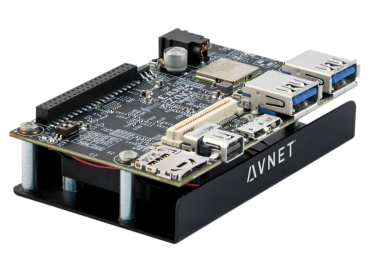

Welcome to Ultra96-PYNQ's documentation!
========================================

This documentation is for the release of PYNQ targetting the Avnet Ultra96 Board.  Specifically, a getting started guide is included here and information on the included boot overlay.  

For more information on PYNQ, please see the PYNQ readthedocs pages: https://pynq.readthedocs.io

.. toctree::
   :maxdepth: 2
   :hidden:
   
   getting_started
   sensors96b_overlay
   for_more_information
