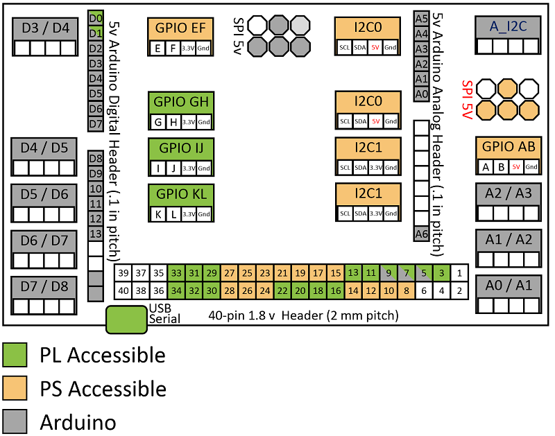
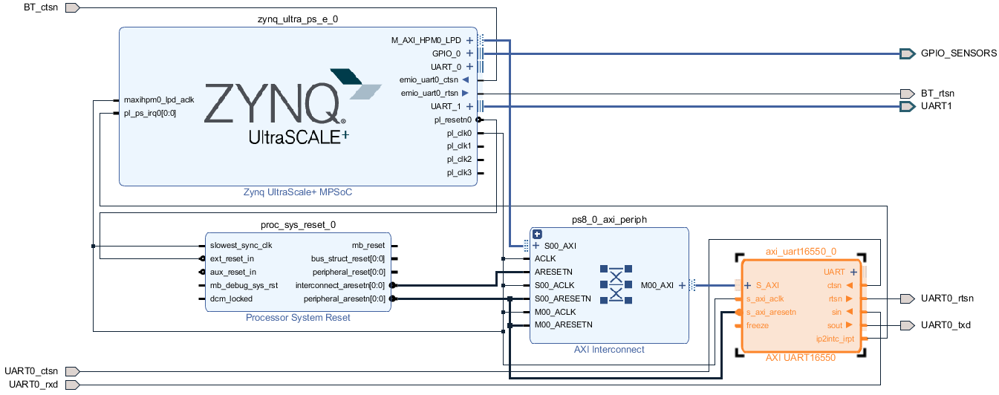

Sensors96b Overlay
==================

`96boards <https://www.96boards.org>`_ is an open set of hardware specifications for ARM based boards to allow manufacturers to provide a common set of features for developers. The Ultra96 follows this specification.  

Sensors96 Mezzanine board
-------------------------

The `Grove starter kit for 96boards <https://www.seeedstudio.com/96Boards-Sensors-p-2617.html>`_ is a mezzanine board that provides interfaces that can be used to connect sensors to  the 40 pin header on the Ultra96. The board includes an Arduino header, a 40 pin female header, and a number of `Grove <http://wiki.seeed.cc/Grove_System/>`_ 4 pin headers. 

The mezzanine board has an Arduino compatible microcontroller that is connected to some of the interfaces on the board. 

The interfaces on the mezzanine board are connect to the microcontroller, the 40-pin header, or available to both (shared). Of the interfaces connected to the 40-pin header (i.e. available to the Ultra96), some are connected to PS pins, and others are connected to PL pins. 

The diagram below shows the interfaces and pin mappings to the PS/PL/Arduino. 

.. Warning Some of the interfaces are 5V and some are 3.3V. Make sure that you do not connect 3.3V peripherals to the 5V lines or it may damage your equipment. 

The following pins are connected to the Ultra96, and available for use with PYNQ:

* Pins 3,5,7-34 on the 40-pin header
* Pins D0, D1 on the Arduino interface (5V)
* I2C0 (5V) and I2C1
* GPIO AB (5V), EF, GH, IJ, KL Grove connectors 

Ultra96 overlay diagram
-----------------------

The sensors96b overlay is an overlay designed to support the `96boards Sensors mezzanine board <https://www.seeedstudio.com/96Boards-Sensors-p2617.html>`_. The overlay is a simple design providing a number of GPIO and a UART to connect to available interfaces on the mezzanine board. 
2x PS I2C are connected to I2C0 and I2C1, PS GPIO are connected to GPIO AB and GF, and PS GPIO are connected to GPIO GH, IJ, KL, through the EMIO. 

96boards sensors kit
--------------------

A number of peripherals and sensors are provided in the 96 boards sensors kit. 

For examples of using the boards96 sensors board and peripherals, see the notebooks in the corresponding *sensors96b* directory in the Jupyter home area. Note that some of the peripherals are analog, and can only be used with the ADC on the Arduino (the XADC on the Zynq Ultrascale+ is not connected to the Ultra96 40-pin header). 

See the example notebook for details:

.. code-block:: console

    <Jupyter home>/sensors96b/sensors_mezzanine_examples.ipynb

Rebuilding the Overlay
----------------------

The project files for the overlay can be found here:

.. code-block:: console

   https://github.com/Avnet/Ultra96-PYNQ/tree/master/Ultra96/sensors96b

Linux
^^^^^
To rebuild the overlay, source the Xilinx tools first. Then assuming Ultra96-PYNQ has 
been cloned: 

.. code-block:: console

   cd <Ultra96-PYNQ>/Ultra96/sensors96b
   make 

Windows
^^^^^^^

To rebuild from the Vivado GUI, open Vivado. In the Vivado Tcl command line 
window, change to the correct directory, and source the Tcl files as 
indicated below. 

Assuming Ultra96-PYNQ has been cloned:
 
.. code-block:: console

   cd <Ultra96-PYNQ>/Ultra96/sensors96b
   source ./sensors96b.tcl

To build from the command line, open the Vivado 2018.3 Tcl Shell, and run the 
following:

.. code-block:: console

   cd <Ultra96-PYNQ>/Ultra96/sensors96b
   vivado -mode batch -source sensors96b.tcl
   
Note that you must change to the overlay directory, as the .tcl files has 
relative paths that will break if sourced from a different location.
